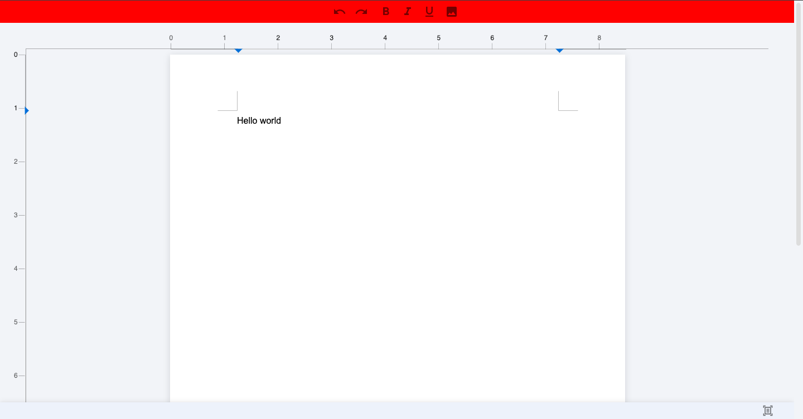
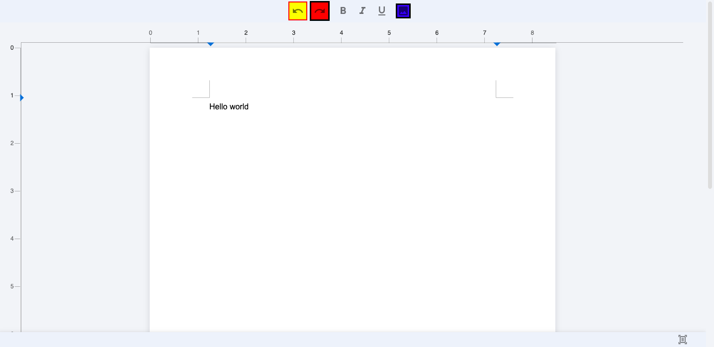
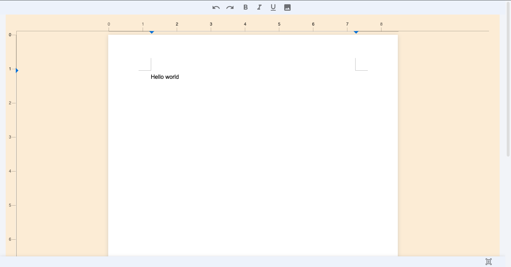

# How to customize style

Tailor the editor's user interface to align with the specific requirements of your application.

## Customize toolbar style

You can adjust the style of the toolbar to meet your design needs. Create a configuration object as follows:

```javascript
toolbarClass = {
  container: {
    backgroundColor: 'red',
  },
  primaryToolbar: {
    justifyContent: 'center',
  },
};
```

Now, integrate this style configuration into your `DocumentEditor` or `DocumentEditorWebComponent`:

- **Angular Component**

  ```html
  <DocumentEditor [toolbar_class]="toolbar_class"></DocumentEditor>
  ```

- **Web Component for React**

  ```html
  <web-doc toolbar_class="{toolbar_class}"></web-doc>
  ```

- **Web Component for JavaScript**

  ```html
  <!-- In you html file add following code in a body tag where you want to use Angular canvas editor -->
  <body>
    <web-doc toolbar_class="${JSON.stringify(toolbar_class)}"></web-doc>
    <script type="module" src="/main.js"></script>
  </body>
  ```

  ```javascript
  // In main.js file(i.e. used as a script in html file) add the following code
  toolbarClass = {
    container: {
      back: 'red',
    },
    primaryToolbar: {
      justify-content : 'center',
    },
  };
  ```



## Customize toolbar components style

To fine-tune the style of individual toolbar components, define styles for items like undo, redo, and images. Here's an example configuration:

```javascript
toolbarClass = {
  item: {
    undo: {
      border: 'red solid 2px',
      background: 'yellow',
    },
    redo: {
      border: 'black solid 3px',
      background: 'blue',
    },
    image: {
      border: 'black solid 3px',
      background: 'blue',
    },
  },
};
```

Apply these styles to your `DocumentEditor` or `DocumentEditorWebComponent`:

- **Angular Component**

  ```html
  <DocumentEditor [toolbar_class]="toolbar_class"></DocumentEditor>
  ```

- **Web Component for React**

  ```html
  <web-doc toolbar_class="{toolbar_class}"></web-doc>
  ```

- **Web Component for JavaScript**

  ```html
  <!-- In you html file add following code in a body tag where you want to use Angular canvas editor -->
  <body>
    <web-doc toolbar_class="${JSON.stringify(toolbar_class)}"></web-doc>
    <script type="module" src="/main.js"></script>
  </body>
  ;
  ```



## Customize toolbar selected components color

You can also customize the color of selected toolbar components. Here's an example configuration:

```typescript
toolbarClass = {
  item: {
    selectedToolbarItemColor: {
      color: '#1a73e8',
    },
  },
};
```

Apply these styles to your `DocumentEditor` or `DocumentEditorWebComponent`:

- **Angular Component**

  ```html
  <DocumentEditor [toolbar_class]="toolbarClass" />;
  ```

- **Web Component for React**

  ```html
  <web-doc toolbar_class="{toolbar_class}"></web-doc>
  ```

- **Web Component for JavaScript**

  ```html
  <!-- In you html file add following code in a body tag where you want to use Angular canvas editor -->
  <web-doc toolbar_class="${JSON.stringify(toolbar_class)}"></web-doc>
  ;
  ```

  ```javascript
  // In main.js file(i.e. used as a script in html file) add the following code
  import '@mindfiredigital/angular-canvas-editor';
  import '@angular/compiler';
  ```


## Customize editor page

You can also customize the appearance of the editor page. Define the styles for the editor main and margin areas:

```typescript
canvasClass = {
  editorMain: {
    background: 'antiquewhite',
  },
  margin: {},
};
```

Incorporate these styles into your `DocumentEditor` or `DocumentEditorWebComponent`:

- **Angular Component**

  ```html
  <DocumentEditor [canvas_class]="canvas_class"></DocumentEditor>
  ```

- **Web Component for React**

  ```html
  <web-doc canvas_class="${JSON.stringify(canvas_class)}"></web-doc>
  ```

- **Web Component for JavaScript**

  ```html
  <!-- In you html file add following code in a body tag where you want to use Angular canvas editor -->
  <body>
    <web-doc canvas_class="${JSON.stringify(canvas_class)}"></web-doc>
    <script type="module" src="/main.js"></script>
  </body>
  ;
  ```

  ```javascript
  // In main.js file(i.e. used as a script in html file) add the following code
  import '@mindfiredigital/angular-canvas-editor';
  import '@angular/compiler';
  ```



By following these steps, you can professionally customize the style of your editor to align with your application's requirements.
