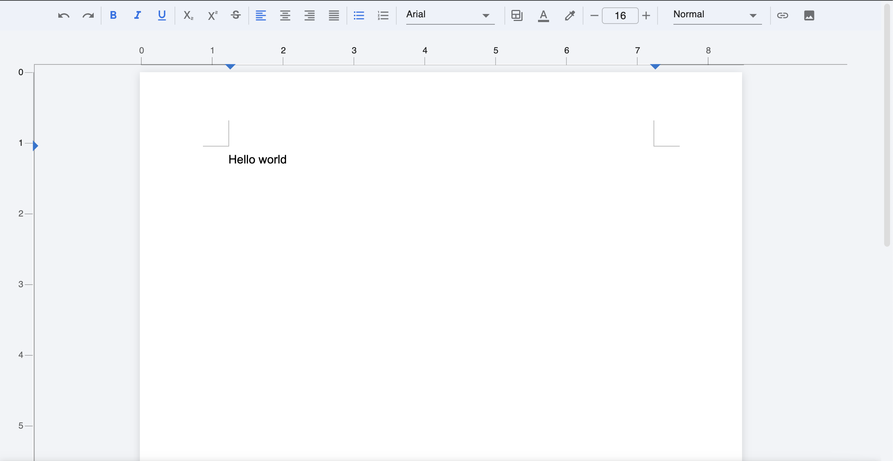

# How to customize style

Tailor the editor's user interface to align with the specific requirements of your application.

## Customize toolbar style

You can adjust the style of the toolbar to meet your design needs. Create a configuration object as follows:

```javascript
const toolbarClass = {
  container: {
    backgroundColor: 'red',
  },
  primaryToolbar: {
    justifyContent: 'center',
  },
};
```

Now, integrate this style configuration into your `DocumentEditor` or `DocumentEditorWebComponent`:

- **React Component**

  ```javascript
  return <DocumentEditor toolbar_class={toolbarClass} />;
  ```

- **Web Component for React**

  ```javascript
  DocumentEditorWebComponent({ toolbar_class: toolbarClass });

  return <div id="document-editor"></div>;
  ```

- **Web Component for JavaScript**

  ```html
  <!-- In you html file add following code in a body tag where you want to use react canvas editor -->
  <body>
    <div id="document-editor"></div>
    <script type="module" src="/main.js"></script>
  </body>
  ```

  ```javascript
  // In main.js file(i.e. used as a script in html file) add the following code
  DocumentEditorWebComponent({ toolbar_class: toolbarClass });
  ```


## Customize toolbar components style

To fine-tune the style of individual toolbar components, define styles for items like undo, redo, and images. Here's an example configuration:

```javascript
const toolbarClass = {
  item: {
    undo: {
      border: 'red solid 2px',
      background: 'yellow',
    },
    redo: {
      border: 'black solid 3px',
      background: 'blue',
    },
    image: {
      border: 'black solid 3px',
      background: 'blue',
    },
  },
};
```

Apply these styles to your `DocumentEditor` or `DocumentEditorWebComponent`:

- **React Component**

  ```javascript
  return <DocumentEditor toolbar_class={toolbarClass} />;
  ```

- **Web Component for React**

  ```javascript
  DocumentEditorWebComponent({ toolbar_class: toolbarItem });

  export const App = () => <div id="document-editor"></div>;
  ```

- **Web Component for JavaScript**

  ```html
  <!-- In you html file add following code in a body tag where you want to use react canvas editor -->
  <body>
    <div id="document-editor"></div>
    <script type="module" src="/main.js"></script>
  </body>
  ;
  ```

  ```javascript
  // In main.js file(i.e. used as a script in html file) add the following code
  DocumentEditorWebComponent({ toolbar_class: toolbarItem });
  ```


## Customize toolbar selected components color

You can also customize the color of selected toolbar components. Here's an example configuration:

```javascript
const toolbarClass = {
  item: {
    selectedToolbarItemColor: {
      color: '#1a73e8',
    },
  },
};
```

Apply these styles to your `DocumentEditor` or `DocumentEditorWebComponent`:

- **React Component**

  ```javascript
  return <DocumentEditor toolbar_class={toolbarClass} />;
  ```

- **Web Component for React**

  ```javascript
  DocumentEditorWebComponent({ toolbar_class: toolbarClass });

  export const App = () => <div id="document-editor"></div>;
  ```

- **Web Component for JavaScript**

  ```html
  <!-- In you html file add following code in a body tag where you want to use react canvas editor -->
  <body>
    <div id="document-editor"></div>
    <script type="module" src="/main.js"></script>
  </body>
  ;
  ```

  ```javascript
  // In main.js file(i.e. used as a script in html file) add the following code
  DocumentEditorWebComponent({ toolbar_class: toolbarClass });
  ```



## Customize editor page

You can also customize the appearance of the editor page. Define the styles for the editor main and margin areas:

```javascript
const canvasClass = {
  editorMain: {
    background: 'antiquewhite',
  },
  margin: {},
};
```

Incorporate these styles into your `DocumentEditor` or `DocumentEditorWebComponent`:

- **React Component**

  ```javascript
  return <DocumentEditor canvas_class={canvasClass} />;
  ```

- **Web Component for React**

  ```javascript
  DocumentEditorWebComponent({ canvas_class: canvasClass });

  export const App = () => <div id="document-editor"></div>;
  ```

- **Web Component for JavaScript**

  ```html
  <!-- In you html file add following code in a body tag where you want to use react canvas editor -->
  <body>
    <div id="document-editor"></div>
    <script type="module" src="/main.js"></script>
  </body>
  ;
  ```

  ```javascript
  // In main.js file(i.e. used as a script in html file) add the following code
  DocumentEditorWebComponent({ canvas_class: canvasClass });
  ```


By following these steps, you can professionally customize the style of your editor to align with your application's requirements.
